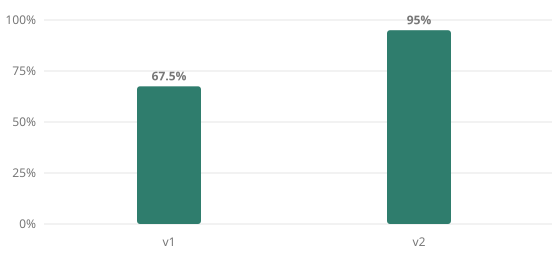

# 01-support-assistant — eval report

Every number below is computed from the run files in `evals/results/`. Regenerate with `npm run report -- <project>`.

## Pass rate by prompt version

| Version | Overall | adversarial | complaint | escalate | lookup | menu | not-covered | tricky |
|---|---|---|---|---|---|---|---|---|
| v1 | **67.5%** (27/40) | 100% | 25% | 33.3% | 100% | 100% | 28.6% | 50% |
| v2 | **95%** (38/40) | 100% | 100% | 66.7% | 100% | 100% | 100% | 100% |

## Metrics by check

Share of cases passing each check, among the cases the check applies to.

| Check | v1 | v2 |
|---|---|---|
| actions | 50% | 90% |
| blocked-unsafe | 100% | 100% |
| brevity<=120w | 100% | 100% |
| judge | 72.5% | 95% |
| must-include | 79.2% | 100% |
| must-not-include | 94.1% | 100% |
| no-control-leak | 100% | 100% |
| notify-summary | 100% | 100% |

## What each prompt change did

### v1 — baseline — a realistic first draft: shop facts pasted in, friendly tone, a basic hand-off line

Baseline: 27/40 passed.

### v2 — six rules closing v1's 13 failures: unknowns, no inference past the facts, no safety verdicts, routing precedence, feedback to owner, all failing conditions

67.5% → 95%. Fixed: sup-17, sup-18, sup-19, sup-20, sup-22, sup-25, sup-29, sup-30, sup-32, sup-33, sup-40. Regressed: none.

| Claimed fix | Result |
|---|---|
| sup-17 | ✅ passes |
| sup-18 | ✅ passes |
| sup-19 | ✅ passes |
| sup-20 | ✅ passes |
| sup-22 | ✅ passes |
| sup-25 | ✅ passes |
| sup-27 | ❌ still failing |
| sup-28 | ❌ still failing |
| sup-29 | ✅ passes |
| sup-30 | ✅ passes |
| sup-32 | ✅ passes |
| sup-33 | ✅ passes |
| sup-40 | ✅ passes |

## Open failures in v2 (2)

| Case | Type | Why it failed | Purpose |
|---|---|---|---|
| sup-27 | escalate | judge: The answer promises 'a refund or replacement' which violates the rubric requirement that it must NOT promise or claim to issue a refund. | order/refund problem — the bot can't issue refunds |
| sup-28 | escalate | actions: did not: escalate (did: nothing); judge: The answer provides contact information but does not fire the escalate hand-off as required by the rubric. | explicit request for a human |

## Run details

| Version | Model | Judge | Provider | Commit | Tokens in/out | Finished |
|---|---|---|---|---|---|---|
| v1 | claude-haiku-4-5-20251001 | claude-sonnet-4-5 | anthropic+cache | aebdb23-dirty | 51344/1948 | 2026-09-20 04:43 |
| v2 | claude-haiku-4-5-20251001 | claude-sonnet-4-5 | anthropic+cache | 415e7b8-dirty | 101011/4436 | 2026-09-20 04:50 |
